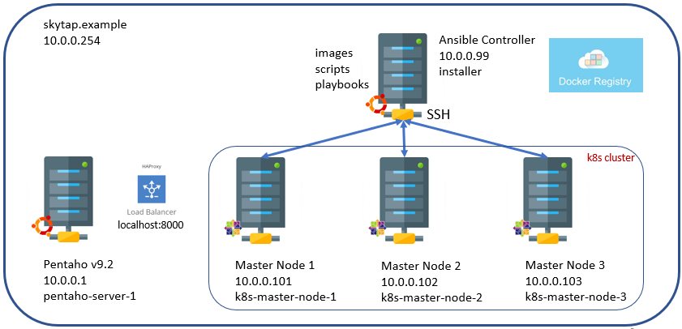

## <font color='red'>Pre-requisites</font>
The following pre-requiste steps have been completed and are listed just for Lab reference. 

This reference section covers:
  * Setup SkyTap Lab environment. 
     
  * Setup of LDOS 1.2.0 Master / Worker Nodes.  
  * Setup of LDOS 1.2.0 Installer.
  * Setup of HAProxy 2.4
  * Setup of Pentaho Server 9.2

  * Generate SSH keys & deploy

---

### <font color='red'>Skytap Lab</font>
The SkyTap Lab environment is configured with: 

SkyTap DNS: 10.0.0.254 - This is automatically assigned.  
Domain Name: skytap.example  

| Server Name               | Host              |  IP address | OS               |
| ------------------------- | ------------------| ----------- | ---------------- |
| Pentaho Server 9.2        | pentaho-server-1  | 10.0.0.1    | Unbuntu 18.0.4   |
| LDOS 1.2.0 Master Node 1  | k8s-master-node-1 | 10.0.0.101  | CentOS 7.5       |    
| LDOS 1.2.0 Master Node 2  | k8s-master-node-2 | 10.0.0.102  | CentOS 7.5       |
| LDOS 1.2.0 Master Node 3  | k8s-master-node-3 | 10.0.0.103  | CentOS 7.5       |
| LDOS 1.2.0 Installer      | installer         | 10.0.0.99   | Unbuntu 20.04.3  | 
|

VM sequence: LDOS Master 1-3 : Pentaho Server 9.2 : LDOS 1.2.0 Installer   



---

### <font color='red'>LDOS 1.2.0 Master / Worker Nodes</font>
These servers were deployed as CentOS 7.5 Firstboot images.
Each of the nodes in the cluster has been configured with a 'k8s' user with sudo priviliges.

update all nodes:
```
sudo yum check-update
sudo yum clean all
sudo reboot
sudo yum update
```

---

<em>add a 'k8s' user to the wheel group (log in as root):</em>
```
usermod -aG wheel k8s
```
check the assigned groups:
```
groups
```
or for the ids:
```
id k8s
```
check 'k8s' user on any master node:
```
ls /home
```

---

<em>install nano:</em>
```
sudo yum install -y nano
```

---

<em>allow users in group wheel to run all commands without password:</em>
```
nano /etc/sudoers
## Allows users in group wheel to run all commands
%wheel  ALL=(ALL)     ALL

## Without password
%wheel  ALL=(ALL)     NOPASSWD:  ALL
```
save:
```
Ctrl +o
enter
Ctrl + x
```

---

### <font color='red'>LDOS 1.2.0 Installer</font>
This server has been configured with an 'installer' user with sudo privileges.  

update (log in as root) :
```
apt update -y
```
add an 'installer' user :
```
adduser installer
```
Note: password is 'lumada'  

add 'installer' to sudo group
```
sudo usermod -aG sudo installer
```
check the assigned groups:
```
groups
```
or for the ids:
```
id installer
```
check 'installer' user:
```
ls /home
```

---

<em>allow users in group sudo to run all commands without password:</em>
```
nano /etc/sudoers
## Allows users in group admin to gain root privileges
%admin  ALL=(ALL)    ALL
%sudo  ALL=(ALL)     ALL  

## Without password
%sudo  ALL=(ALL)     NOPASSWD:  ALL
```
save:
```
Ctrl +o
enter
Ctrl + x
```
reboot and check user:
```
sudo reboot
sudo -v
```

---

### <font color='red'>Other Required Packages on Installer Server</font>
Enusre that the following packages are also installed and configured:
* openssh server and client
* pip & pip3
* git
* visual studio code - just for training purposes
* tree - visualize directories

---

<em>install openssh server:</em>  
ssh should already be installed:
```
ssh -V
```
Note: you are currently only able to connect as a client to SSH servers
```
sudo apt install openssh-server 
```
verify service is running:
```
sudo systemctl status sshd
```
Note: By default, your SSH server is listening on port 22.
if you need further details:
```
sudo apt-get install net-tools
netstat -tulpn | grep 22^
```
If you are using UFW as a default firewall on your Ubuntu 20.04 host, it is likely that you need to allow SSH connections on your host:
```
sudo ufw status
```
Note: For training purposes it is inactive.
to enable SSH connections on your host:
```
sudo ufw allow ssh
```

---

<em>install pip3 & pip:</em>
```
sudo apt install python3-pip
```
verify pip3 installation:
```
pip3 --version
```
enable the universe repository for pip:
```
sudo add-apt-repository universe
```
install python2:
```
sudo apt update
sudo apt install python2
```
Use curl to download the get-pip.py script:
```
sudo apt install curl
curl https://bootstrap.pypa.io/pip/2.7/get-pip.py --output get-pip.py
```
install pip for Python 2:
```
sudo python2 get-pip.py
```
verify pip2 installation:
```
pip2 --version
```

---

<em>install git:</em>
Access the Git repository
```
sudo apt install git
```
verify the installation:
```
git --version
```

---

<em>install Visual Studio Code:</em>
```
apt install snapd
sudo snap install --classic code
```
Note: Whenever a new version is released, Visual Studio Code package will be automatically updated in the background.
to use VSC:
```
cd
code
```

---

<em>install tree:</em>
```
sudo apt-get update -y
sudo apt-get install -y tree
reboot
```

---

#### <font color='red'>SSH Keys</font>
Generate the required SSH keys to connect to LDOS nodes.  
You will need the IPs of the Cluster Nodes - refer to table above.

generate ssh key:
```
cd
ssh-keygen
```
Note: keys are located in .ssh directory. 2 keys: id_rsa (private) id_rsa.pub (public)

copy over key to k8s user on LDOS nodes:
```
ssh-copy-id k8s@10.0.0.101 (10.0.0.102, 10.0.0.103)
```
Note: this will copy over both the private and public keys.


test passwordless ssh connection:
```
ssh -i ~/.ssh/id_rsa  k8s@10.0.0.101
```

---

### <font color='red'>Pentaho Server 9.2</font>


### <font color='red'>HA Proxy</font>
Install the latest HAProxy using a PPA.

  > browse to: https://haproxy.debian.net/

 Note: use the wizard to generate commands.

 enable PPA (log in as root):
```
 apt-get install --no-install-recommends software-properties-common
 add-apt-repository ppa:vbernat/haproxy-2.4
```
then install:
```
apt-get install haproxy=2.4.\*
```
verify installation:
```
haproxy -v
```
update and upgrade:
```
sudo apt update && sudo apt upgrade -y
```

#### <font color='red'>Configure HAProxy</font>
HAProxy is an open-source High availability proxy and load balancer that is popularly known for its efficiency and speed. Works for TCP and HTTP protocols, it is used to enhance the performance of a website by splitting up the load across multiple servers and to simplify the request processing tasks. 

Configure HAProxy to load-balance across the cluster.

to install haproxy:
```
sudo apt-get install haproxy
```

the configuration file is located at:  
  /etc/haproxy/haproxy.cfg

Details can be found at: 
  > browse to: https://www.haproxy.com/documentation/hapee/latest/configuration/config-sections/defaults/


rename the existing /etc/haproxy/haproxy.cfg to haproxy.cfg.bak:
```
cd /etc/haproxy
mv haproxy.cfg  haproxy.cfg.bak
```
copy over 01-Infrastructure/01-Environment/haproxy.cfg to /etc/haproxy:
```


```

---