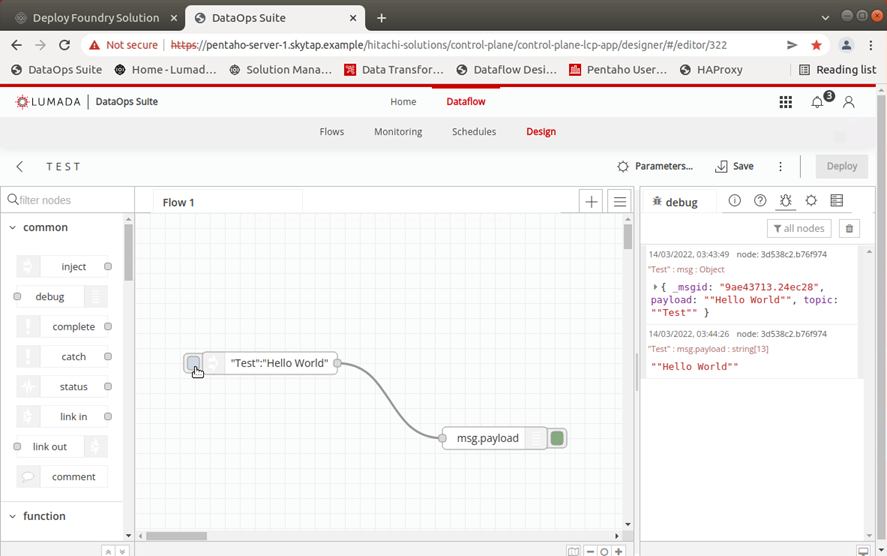

## <font color='red'>Post-Installation Tasks</font>  

The following post-installation tasks need to be completed:
* Licenses for Lumada Data Integration
* License for Lumada Data Catalog

* Installation of Dataflow Designer 0.7.0

The following playbook is run:

#### install_dataflow-designer-0.7.0.yml
* Creates a Dataflow Designer directory
* Unarchives Dataflow Designer 0.7.0
* Prepares env.properties file
* Upload Dataflow Designer charts & images
* Install Dataflow Designer 0.7.0

---

<em>Lumada Data Integration Licenses</em>

The LDOS package doesn’t contain licenses.   
Please contact Customer Success or Product Management on how to get a license.  
The Data Transformation Editor and Dataflow Engine require a Pentaho EE license to run.  

Configure the path to the .installedLicenses.xml before you install LDOS.

ensure you are on the HA Proxy server.

``copy Pentaho EE license file (HA Proxy):`` 
 ```
 cd Downloads (or directory where .installedLicenses.xml is located)
 sudo mkdir /data/pdi/licenses
 sudo cp -rfp *.xml /data/pdi/licenses/
```
Note: LICENSE_PATH=/data/pdi/licenses/.installedLicenses.xml"

Note: When you start Dataflow Transformation Editor, you will need to add the path to licenses.

Data Engineer account credentials:  
user: bwayne
password: bwayne

If you forget to copy over the Pentaho License, before you install LDOS:  
* uninstall DTE 
* add the license to the path and 
* re-install DTE.

<font color='green'>The PDI EE licenses have been copied over.</font>

---

<em>Lumada Data Catalog License</em>  

The Lumada Data Catalog is by default a light version (some functions are disabled).  
Please contact either your account manager or dstraining@hitachivantara.com

``upgrade the Catalog license (Ansible Controller):``
```
kubectl create secret generic ldc-license --from-file=license-features.yaml
 --from-file=ldc-license-public-keystore.p12 -n hitachi-solutions
```
Note: Files must be named license-features.yaml and ldc-license-public-keystore.p12

Navigate to the Solution management UI -> Installed -> Lumada Data Catalog  
``add the following lines to values.yml:``

<pre><code>global:  
  coreSiteSecret: {}  
  ldc:                          <font color='green'> # line 4 </font>  
    licenseSecret: ldc-license  <font color='green'> # line 5 </font> </code></pre> 
 
 Click: Save and the Lumada Data Catalog will activate the license.

Data Steward account credentials:
user: mpayton
password: mpayton

---

#### <font color='red'>Installation of Dataflow Designer - 0.7.0</font> 

The Dataflow Designer is a variant of Node-RED, built on top of Node.js.  With Dataflow Designer you can add or remove Nodes, wire them together, in order to define Flows.  

``run the playbook - install_dataflow-designer-0.7.0.yml:``
```
cd /etc/ansible/playbooks
ansible-playbook -i hosts-skytap.yml --extra-vars="@extra-vars.yml" -b -v install_dataflow-designer-0.7.0.yml
```
Note: This will take about 15mins to complete. 

<em>Hello World Flow</em> 



Below is a very quick 2Hello World" flow that introduces the key concepts:  

* Drag and drop an inject node on the flow editor. 
* Then double click and set up the payload as string and write “Hello world”.
* Drag and drop a debug node, the same way as you did with the inject one.
* Wire them together.
* Click on the “Deploy” button up in the right corner.
* Select the debug option.
* Click on the blue button just left of the inject node.

---
